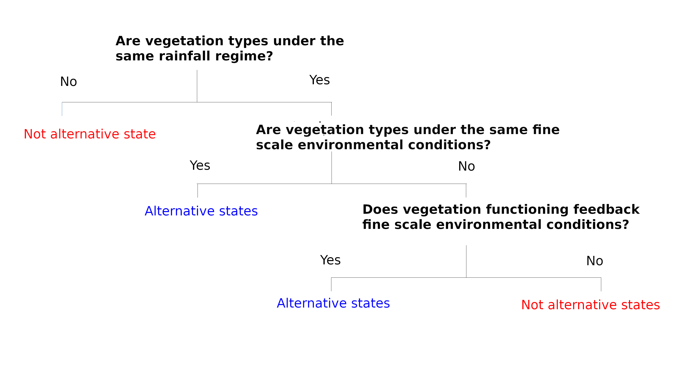

class: top, center

```{r setup, include=FALSE}
options(htmltools.dir.version = FALSE)
```

```{r webcam, echo=FALSE, include= TRUE}
xaringanExtra::use_webcam()
```

```{r xaringan_themes, echo = FALSE, include=FALSE}
	names(xaringan:::list_css())
```

```{r broadcast, echo=FALSE}
xaringanExtra::use_broadcast()

```

# Sistemas dinâmicos e complexos

.left[

### Dinâmico

- Muda com o tempo

]

.center[


]

---
class: top, center 

# Problema da complexidade

.left[

### Complexo

- Formado por múltiplos elementos que interagem entre si.
]


*Modelos lineares não levam em conta interações*

---
class: top, left

# Solução qualitativa
##Soluções simples para problemas complexos

- Henri Poincaré: Informações a respeito do comportamento e propriedades de sistemas complexos.

.center[

]

---

# Resiliência ecológica

### Conceito que ajuda a descrever e entender a dinâmica de sistemas complexos.

- Capacidade que os sistemas possuem de absorver impactos antes de colapsar para um estado alternativo de funcionamento

- Estados alternativos

- Capacidade de auto organização de um sistema (feedbacks)


Resilience and Stability of Ecological Systems (1973):  https://www.annualreviews.org/doi/10.1146/annurev.es.04.110173.000245
---
class: top, left

# Formas como ocorrem as mudanças

.center[

]

--
.center[

]


---
# Representação gráfica intuitiva

- Modelo Eurístico

- Duas formas de mudar para um estado alternativo: 1. Impactos pontuais; 2. erosão da resiliência.

.center[

]

--
.center[
]


---
# Redes ecológicas


- Redes ecológicas são uma maneira de representar a estrurura das comunidades em termos de suas interações [Landi et al, 2018](https://doi.org/10.1007/s10144-018-0628-3).

- A interação entre polinizadores e plantas é fundamental para a manutenção da biodiversidade e para a emergência de diversos serviços ecossistêmicos, inclusive os de suporte [MEA](https://www.millenniumassessment.org); [IPBES](https://ipbes.net/).

- As perdas de biodiversidade e as mudanças climáticas, que já ultrapassaram os limites seguros planetários ([Rockström et al, 2009](https://www.nature.com/articles/461472a)), poderiam impactar de forma irreversível as interações que estruturam os ecossistemas [Scheffer et al 2012](https://www.science.org/doi/10.1126/science.1225244).

.center[
]

---
# Pergunta:

- **É possível fazer inferências acerca da resiliência das redes ecológicas em relação às métricas que definem a sua estrutura em um gradiente climático?**

## Hipótese:

- **Existe uma certa estabilidade interrompida abruptamente ao cruzar um certo limiar de condições**.
Exemplo:
.center[

]
---
class: left

# Métodos

### Dados: 
- Os dados de polinização para a região tropical do Brasil foram obtidos a partir do web-of-life dataset. Os dados climáticos foram obtidos usando a função ```raster::getData``` que busca os dados do WorldClim. Mas você também pode baixar direto do site.

- As métricas de rede utilizadas neste trabalho são:

1. Conectância: proporção dos links potenciais que são realizados.
2. Robustez à perda de espécies (nodes)
3. Número de interações na rede
4. Número de espécies (representado pelo tamanho dos pontos)
5. Aninhamento (NODF)


- As variáveis ambientais são:

1. Temperatura média anual;
2. Precipitação média anual;
3. Sazonalidade da precipitação (cv); e
4. Sazonalidade da temperatura.


---
# Métodos
### Estados alternativos:
- Inferência visual de bistabilidade das métricas (variáveis de estado).

- Análise de componentes principais e agrupamento dos dados por K-means.

- Autocorrelação temporal

- Variância



---
# Métodos

### Indicadores de resiliência


---
## Resultados

### Aparentemente há multiestabilidade.

.center[

]

---
## Resultados

### PCA das métricas de redes formam 6 grupos segundo o algorítmo K-means.

.center[

]

---

## Resultados

### PCA das métricas de redes em relação aos eigenvectors.

.center[

]

---
### Resultados


.center[

]

---
### Resultados

#### PCA das métricas de redes em relação às variáveis ambientais.

.center[

]

---
### Resultados

#### Autocorrelação 

.center[

]

---
# Resultados

- As redes de polinização formam 6 grupos com estruturas de redes distintas entre si.

- Há multimodalidade segundo as curvas de densidade de distribuição (flexmix)

- O aumento da temperatura média anual parece ter efeito na variância das métricas


---
# Considerações finais

- Provavelmente há estados alternativos em relação às métricas que descrevem a estrutura das redes ecológicas em relação à um gradiente de condições, mas o estudo requer testes mais formais.

- É preciso entender os feedbacks que estão relacionados com a estabilidade das métricas e quanto a estrutura precisa mudar para que os efeitos na funcionalidade do ecossistema seja significativo.


O próximo passo seria testar estas mesmas métricas, mas separando por:

1. Cobertura do dossel; pra ver de forma simples e generalizada, mas mesmo assim bem frequente e aceita na literatura, se redes em tipos diferentes de vegetação possuem padrões de resposta diferentes.

2. Guildas; pra ver se diferentes guildas possuem padrões de resposta diferentes.

---
## Apresentação e script

- Apresentação está disponível em https://github.com/Mauritia-flexuosa/ecological-network-presentation

- O script e os dados estão disponíveis em: https://github.com/Mauritia-flexuosa/redes-ecologicas

<footer><p class="small">

<h3>Contatos:</h3>

<div>
<a href = "mailto:marciobcure@gmail.com"></a>
 <a href="https://instagram.com/marciobcure" target="_blank"></a>
</div>
</p></footer>
